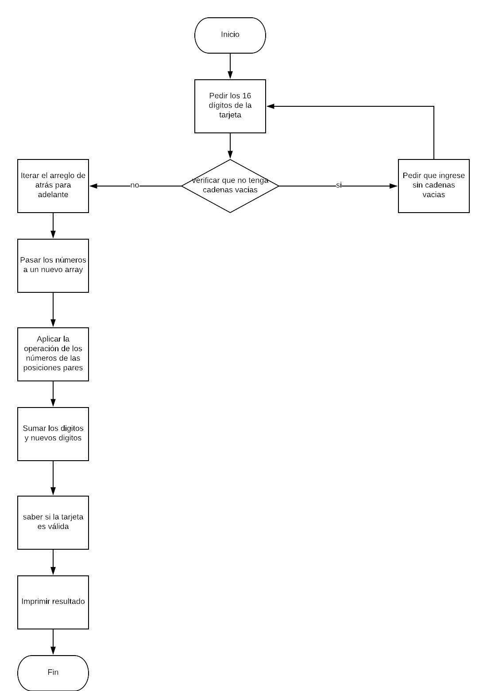

## Tarjeta de crédito válida
## Descripción
Crea una web que pida, por medio de un prompt(), el número de una tarjeta de crédito y confirme su validez según el algoritmo de Luhn.
Consideraciones Específicas
Debe estar compuesto por 1 función: isValidCard.
El usuario no debe poder ingresar un campo vacío.
##Pseudocodigo
Pedir los 16 dígitos de la tarjeta de crédito.
Recorrer el arreglo y verificar que no tenga cadenas vacías.
Iterar el arreglo de atrás para adelante.
Pasar los números a un nuevo array.
Aplicar la operación de los números de las posiciones pares.
Sumar los dígitos y nuevos dígitos.
Saber si la tarjeta es válida.
Imprimir el resultado.

#### Diagrama de flujo

